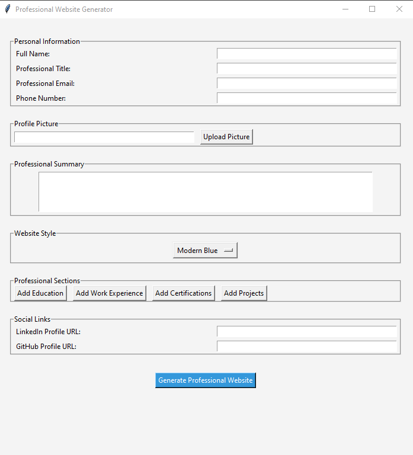
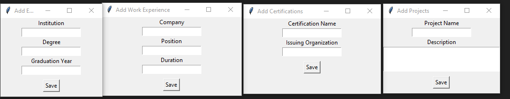
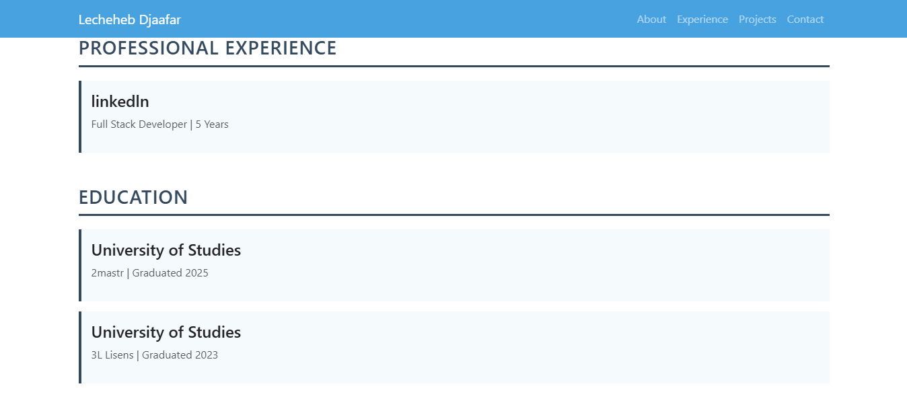
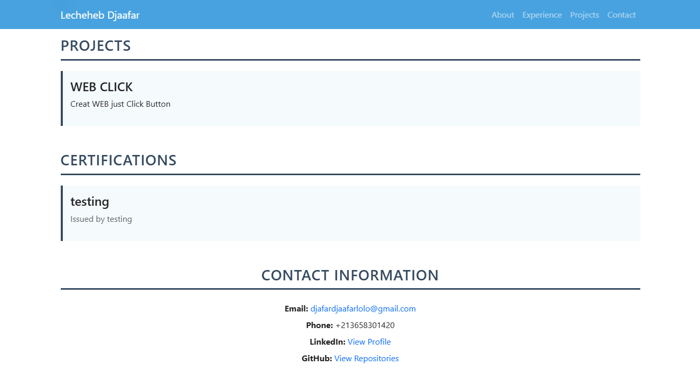

# WebGenPy

WebGenPy is a Python-powered tool that allows you to create fully functional websites effortlessly. Using a simple **Tkinter** GUI, you can input your details, customize features, and generate a complete website tailored to your needs.

---

## Features

- **User-Friendly Interface**: Simple and clean design for easy input.  
- **Automatic Website Generation**: No coding required—just enter your details.  
- **Customizable**: Supports adding personal information, links, and more.  
- **Fast Deployment**: Generates a complete website structure within seconds.

---

## How It Works

1. Open the application (GUI built with Tkinter).
2. Fill in the required information such as:
   - Name, Email, Phone
   - LinkedIn and GitHub profiles
3. Click "Generate Website".
4. Your complete website is generated in HTML/CSS format, ready to use!

---

## Screenshots

### Main Interface



### Input Section




---

## Requirements

- Python 3.7+
- Libraries: `tkinter`

---

## How to Run

1. Clone this repository:
   ```bash
   git clone https://github.com/your-username/WebGenPy.git
   cd WebGenPy
2. Run the Python script:
   ```bash
   python webgenpy.py

